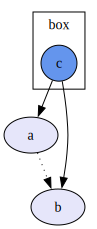

# :mage_woman: GraphWiz

[![build status][BuildShield]][BuildLink]


GraphWiz provides builders to generate and render graphs in the [GraphViz DOT
//! format](https://graphviz.org/). It is adapted from [its Haskell
equivalent](https://github.com/nicuveo/graphwiz).

It's a "wizard" for Graphviz's DOT format, hence the name "GraphWiz".

[BuildLink]:   https://github.com/nicuveo/graphwiz-rs/actions/workflows/rust.yml?query=branch%3Amain
[BuildShield]: https://img.shields.io/github/actions/workflow/status/nicuveo/graphwiz-rs/rust.yml?event=push&style=flat&branch=main&label=build

### Overview

This library is centered around a simple trait: `Builder`. Each `Builder` is
tied to a given "scope" of the graph: a `RootBuilder` is the scope of the
top-level graph definition, while a `SubgraphBuilder` represents the scope of
its associated subgraph or cluster. A builder provide functions to add new
entities within its scope: nodes, edges, subgraphs, and clusters.

Each entity is given a unique internal identifier, which avoid naming issues
within the graph. Furthermore, edges are "smart" and do "auto-compound": if an
edge starts from or goes to a cluster, the graph is labelled as "compound", and
the [attributes of the edge](https://graphviz.org/docs/attrs/lhead/) are
adjusted so that they point properly to the cluster.

### Example

The test file `example.rs` contains the following:

```rust
let mut root = Graph::new_builder();
root.defaults_mut(Kind::Node).extend(HashMap::from([
    (attrs::FILLCOLOR, "lavender".to_string()),
    (attrs::STYLE, "filled".to_string()),
]));

let a = root.new_node("a");
let b = root.new_node("b");
let ab = root.new_edge(a, b);
root.attributes_mut(ab)
    .insert(attrs::STYLE, "dotted".to_string());

let mut cluster = root.new_cluster("box");
let c = cluster.new_node_with(
    "c",
    HashMap::from([
        (attrs::SHAPE, "circle".to_string()),
        (attrs::FILLCOLOR, "cornflowerblue".to_string()),
    ]),
);
cluster.build();

root.new_edge(c, a);
root.new_edge(c, b);
let graph = root.build();
let text = render_digraph(&graph);
```

This generates the following DOT graph.

```DOT
digraph {
    node_1 [fillcolor="lavender", label="a", style="filled"]
    node_2 [fillcolor="lavender", label="b", style="filled"]
    node_1 -> node_2 [style="dotted"]
    node_5 -> node_1
    node_5 -> node_2
    subgraph cluster_4 {
        label="box"
        node_5 [fillcolor="cornflowerblue", label="c", shape="circle", style="filled"]
    }
}
```

Which DOT renders like this:


