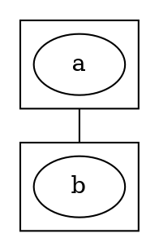

# :mage_woman: GraphWiz

[![build status][BuildShield]][BuildLink]


GraphWiz provides a small set of builders that help generate DOT files. It is adapted from [its Haskell equivalent](https://github.com/nicuveo/graphwiz).

It's a "wizard" for Graphviz's DOT format, hence the name "GraphWiz".

[BuildLink]:   https://github.com/nicuveo/graphwiz-rs/actions/workflows/rust.yml?query=branch%3Amain
[BuildShield]: https://img.shields.io/github/actions/workflow/status/nicuveo/graphwiz-rs/rust.yml?event=push&style=flat&branch=main&label=build

## Overview

### Graph creation

To create a graph, you need a `Builder`: each builder is capable of adding elements at its scope or to create sub-builders that borrow the underlying data. All functions that create an element return an `Entity`, an ID that uniquely identifies that element within the graph.

```rust
let mut builder = Graph::new_builder();
let a = builder.new_node("a");
let b = builder.new_node("b");
builder.new_edge(a, b);

let mut subgraph = builder.new_subgraph();
let c = subgraph.new_node("c");
subgraph.new_edge(a, c);
subgraph.new_edge(b, c);
subgraph.build();

let graph = builder.build();
render_digraph(graph);
```

A `Builder` must be finalized with `build` to release its hold on the underlying reference, or simply be dropped.

### Attributes

You can set default attributes for an entity type with `defaults`, and you can access the attributes of a specific entity with `attributes`. Additionally, all entities' `new_x` methods accept a `new_x_with` version that takes additional attributes to set.

Attributes are represented as a simple mapping from `&str` to `String`, to avoid being too restrictive.

```rust
let mut builder = Graph::new_builder();

builder
    .defaults_mut(Kind::Edge)
    .extend(HashMap::from([
        ("style", "dotted".to_string()),
        ("color", "blue".to_string()),
    ]));
builder
    .defaults_mut(Kind::Node)
    .extend(HashMap::from([
        ("shape", "hexagon".to_string())
    ]));
let x = builder.
    new_node_with("x", HashMap::from([
        ("shape", "hexagon".to_string()),
        ("fontcolor", "red".to_string()),
    ]));
println!("{:?}", builder.attributes(x));
```

### Auto compound

The DOT syntax to draw edges between clusters is quite cumbersome. We have to declare the graph to be `compound`, and we have to create the edge between two nodes within the clusters, with specific attributes.



GraphWiz automates the task: if one end of an edge is a cluster, the `compound` attribute is added to the graph, and the correct attributes are set at rendering time. To be as unobtrusive as possible, the values of `ltail` and `lhead` will not be updated if already present, trusting the user to know best.

## Full example

From the [tests](tests/golden.rs):

##### Rust source
```rust
let mut builder = Graph::new_builder();
builder
    .defaults_mut(Kind::Node)
    .insert("style", "filled".to_string());

let mut front = builder.new_cluster("front end");
let code = front.new_node_with(
    "source code",
    HashMap::from([("fillcolor", "#c3ffd8".to_string())]),
);
let ast = front.new_node_with("AST", HashMap::from([("fillcolor", "yellow".to_string())]));
front.new_edge_with(code, ast, HashMap::from([("label", "parsing".to_string())]));
front.build();

let mut middle = builder.new_cluster("middle end");
let ir = middle.new_node_with(
    "IR",
    HashMap::from([
        ("fillcolor", "salmon".to_string()),
        ("shape", "diamond".to_string()),
    ]),
);
middle.new_edge_with(
    ast,
    ir,
    HashMap::from([
        ("label", "lowering".to_string()),
        ("style", "dotted".to_string()),
    ]),
);
middle.build();

let text = render_digraph(&builder.build());
```

#### Resulting DOT file

```DOT
graph {
    subgraph cluster_1 {
        label="front end"
        node_2 [fillcolor="#c3ffd8", label="source code", style="filled"]
        node_3 [fillcolor="yellow", label="AST", style="filled"]
        node_2 -> node_3 [label="parsing"]
    }
    subgraph cluster_5 {
        label="middle end"
        node_6 [fillcolor="salmon", label="IR", shape="diamond", style="filled"]
        node_3 -> node_6 [label="lowering", style="dotted"]
    }
}
```
